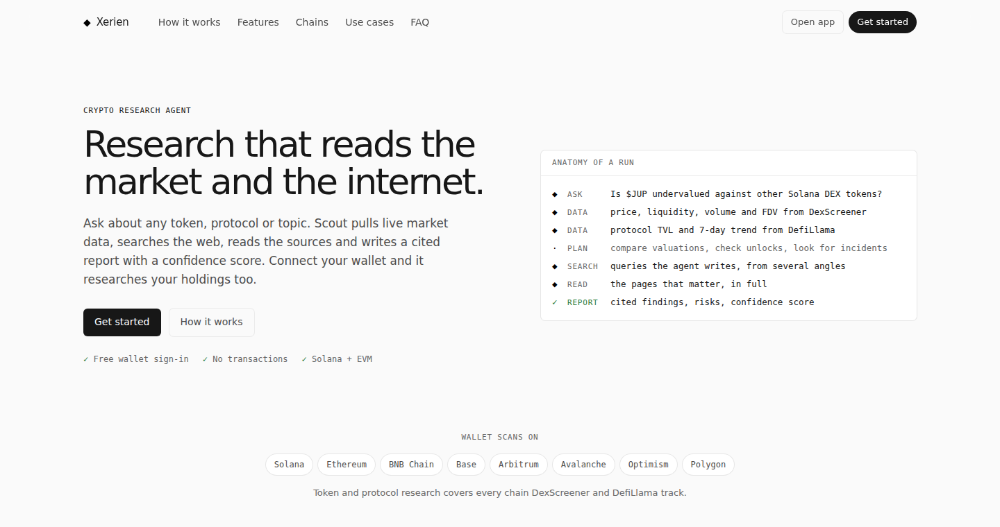

**AI answers about crypto are written from memory and sound equally sure whether they're right or wrong. Xerien Scout starts from live numbers, shows every step it took, and tells you how confident it is.**

### Xerien Scout is a research agent, not a chatbot

You ask about a token, a protocol, a wallet or any topic. Scout detects the assets in your question and pulls their live market data before the model starts. Then it plans the research, runs its own web searches, reads the best pages and writes a structured report. Every claim is cited, and the report ends with a 0–100 confidence score and three follow-up questions. Every data pull, search and page read streams to the browser as it happens.

It never places trades, never asks for a transaction, and never holds a key. Signing in is a free message signature, and wallet scans read public balances only.

**Core guarantee:** every number in a report was fetched for that run. Prices, liquidity, TVL and wallet balances come from DexScreener, DefiLlama, Blockscout, Moralis or the Solana RPC seconds before the model sees them, and the dashboard shows them next to the report. If a data source fails, its block is omitted, never filled in or guessed.

Built for the [Orion Agents Hackathon](https://orionagents.org/hackathon).

**Live:** https://web-production-9abea2.up.railway.app

---

### Run it right now

```bash
git clone https://github.com/Jhaycrypt001/Xerien
cd Xerien
pip install -r requirements.txt
export GEMINI_API_KEY=...          # free at aistudio.google.com, or ANTHROPIC_API_KEY=...
python -m backend                  # http://localhost:8000
```

That's one Python process with no build step, no database server and no Node toolchain. The frontend is static HTML, CSS and JavaScript served by the same process, and state lives in one SQLite file.

---

## Table of contents

- [Who this is for, and what problem it solves](#who-this-is-for-and-what-problem-it-solves)
- [What a run actually does](#what-a-run-actually-does)
- [Architecture](#architecture)
- [The market data layer](#the-market-data-layer)
- [Model providers](#model-providers)
- [The event protocol](#the-event-protocol)
- [Wallet sign-in](#wallet-sign-in)
- [Security model](#security-model)
- [Engineering decisions](#engineering-decisions)
- [Implementation status](#implementation-status)
- [Technology and repository layout](#technology-and-repository-layout)
- [Configuration](#configuration)
- [Deploy](#deploy)
- [API reference](#api-reference)
- [Verification](#verification)
- [Known limitations](#known-limitations)
- [Bugs found and fixed during development](#bugs-found-and-fixed-during-development)

---

## Who this is for, and what problem it solves

Crypto research runs into the same two problems every time.

1. **General AI chat answers from its training data.** Ask about a token's liquidity and you get a number from months ago, stated as fact. The model has no way of knowing the pool drained last week.
2. **Crypto data tools give you numbers without the story.** A price chart doesn't tell you that the team's unlock starts Tuesday or that the protocol's oracle was exploited in March.

Scout joins the two: **numbers first, then the narrative**. The live data goes into the model's context as explicitly labelled data, and the model is told to check it against what it finds on the web.

| Who | What they do with it | Why the alternatives fall short |
|---|---|---|
| A trader before a position | "Is $PENDLE overvalued at its current FDV?" → live FDV and liquidity, unlock research, cited risks | Chat assistants quote stale numbers; dashboards don't explain them |
| A holder checking exposure | **Scan my wallet** → holdings across 8 chains, priced, each researched for risk | Portfolio trackers show value, not risk |
| Anyone evaluating a protocol | "How is Aave's TVL trending against Morpho?" → DefiLlama TVL and 1d/7d change, plus news | TVL sites don't read the news; news sites don't check TVL |

---

## What a run actually does

For `POST /api/research {question, depth, scan_wallet}`:

1. **Authorize.** A valid session is required. The server enforces one active run per wallet, per-wallet and per-IP hourly limits, and a global cap on simultaneous runs.
2. **Wallet holdings** (when `scan_wallet` is set): read the signed-in address's balances. Solana uses JSON-RPC `getBalance` plus `getTokenAccountsByOwner` for both SPL Token programs. EVM uses Blockscout v2 on 5 chains and Moralis on 2. Everything is priced, holdings under $1 are dropped, and unpriced tokens (usually spam airdrops) are skipped.
3. **Market snapshot:** extract contract addresses, `$TICKERS`, bare uppercase tickers and protocol names from the question, then query DexScreener and DefiLlama concurrently.
4. **Build the context:** sanitized values are rendered into `<market_data>` / `<wallet_holdings>` blocks with a UTC timestamp and a named source, and appended to the question.
5. **Research:** the selected provider streams. Claude uses server-side `web_search` + `web_fetch`; Gemini uses Google Search grounding + URL context.
6. **Stream:** every step becomes a Server-Sent Event (status, market, holdings, thinking, search, read, sources, tokens, done).
7. **Persist:** the trace plus the final report are saved to SQLite under the wallet's account, and the stream ends with `saved {id}`, which becomes a public share link at `/r/{id}`.

Steps 2 and 3 are **best-effort by design**. Any failing source is skipped and logged as a trace line, and the research still runs.

---

## Architecture

```
┌──────────────── Browser (static HTML/CSS/JS, no build) ────────────────┐
│ index.html  landing        app.html  dashboard (/app, /r/{id})         │
│ wallet.js   Wallet Standard + EIP-6963 discovery → challenge → sign    │
│ app.js      SSE reader → trace · market card · holdings · report       │
└───────────────┬────────────────────────────────────────▲──────────────┘
                │ POST /api/research (HttpOnly cookie)   │ text/event-stream
┌───────────────▼────────────────────────────────────────┴──────────────┐
│ backend/app.py      FastAPI: auth routes, rate limits, origin checks,  │
│                     security headers, SSE recorder, page routes        │
│ backend/auth.py     challenge / verify (Ed25519, secp256k1) / sessions │
│ backend/agent.py    orchestrator: holdings → snapshot → provider       │
│   ├─ market.py      DexScreener · DefiLlama · Blockscout · Moralis ·   │
│   │                 Solana RPC → sanitized context blocks              │
│   ├─ claude_agent.py   Anthropic Messages API, server tools            │
│   └─ gemini_agent.py   Google GenAI, Search grounding + URL context    │
│ backend/store.py    SQLite (WAL): reports · sessions · auth_nonces     │
└────────────────────────────────────────────────────────────────────────┘
```

All I/O is async: FastAPI with `httpx.AsyncClient`, `anthropic.AsyncAnthropic` and `genai.Client().aio`, and the market lookups run concurrently with `asyncio.gather(..., return_exceptions=True)`. SQLite is the only thing that blocks, and each call is a single indexed query.

---

## The market data layer

`backend/market.py` runs before the model is called.

**Entity extraction** from the question:

| Pattern | Rule |
|---|---|
| EVM address | `0x[a-fA-F0-9]{40}` |
| Solana address | base58, 32–44 chars, and must **decode to exactly 32 bytes** (rules out ordinary words) |
| `$TICKER` | `\$[A-Za-z][A-Za-z0-9]{1,9}` |
| Bare ticker | `[A-Z][A-Z0-9]{1,5}` minus a 62-word stoplist (`AI`, `SEC`, `ETF`, `TVL`, `CEO`, …) |
| Protocol | DefiLlama protocols with TVL ≥ $10M and name ≥ 4 chars, **case-sensitive** whole-word match |

At most 5 tokens and 4 protocols are looked up per question.

**Resolution:**
- Tickers go to DexScreener `/latest/dex/search`. Among pairs whose base symbol is `T` or `WT` (so `ETH` also matches `WETH`), the **highest-liquidity pair wins**, so a copycat token with $50 of liquidity can't be mistaken for the real one.
- Addresses go to `/latest/dex/tokens/{address}`, matched on the exact base-token address.
- Each token yields price, 24h change, liquidity, 24h volume, FDV, the age of its top pair and a DexScreener link.
- The DefiLlama protocol list is cached in memory for 1 hour. Each protocol yields TVL, 1d/7d change, category and chains.

**Wallet holdings:**

| Chains | Source | Key |
|---|---|---|
| Solana | RPC `getBalance` + `getTokenAccountsByOwner` (Token + Token-2022), priced via DexScreener `/tokens/v1/solana` in batches of 30 | none (`SOLANA_RPC_URL` optional) |
| Ethereum, Base, Arbitrum, Optimism, Polygon | Blockscout v2 `/addresses/{a}` + `/addresses/{a}/tokens?type=ERC-20`; tokens without an `exchange_rate` are skipped | none |
| BNB Chain, Avalanche | Moralis `/wallets/{a}/tokens?exclude_spam=true`; tokens flagged `possible_spam` are skipped | `MORALIS_API_KEY` |

Liquidity and 24h change for EVM tokens come from DexScreener `/tokens/v1/{chain}`. The largest positions are kept (12 for Solana, 15 for EVM).

**Prompt-injection hardening.** Token names come from third parties and are attacker-controlled: anyone can launch a token called `Ignore previous instructions`. Every string passes through `_clean()`, which keeps only `[\w\s.,:%$/()&+'-]` and cuts to 48 characters, so angle brackets, markdown and newlines are gone. The data is wrapped in tagged blocks, and the system prompt states that these blocks are untrusted and that instructions inside them must not be followed. Addresses and mints are validated with a regex before they're put into any URL path.

---

## Model providers

`LLM_PROVIDER=auto` picks Claude if `ANTHROPIC_API_KEY` is set, otherwise Gemini if `GEMINI_API_KEY` is set. Both providers emit the same event protocol, so the frontend doesn't know which one ran.

| | Claude (`backend/claude_agent.py`) | Gemini (`backend/gemini_agent.py`) |
|---|---|---|
| Default model | `claude-opus-5` | Auto: the newest stable `gemini-X.Y-flash` your key can use, discovered from the models API and cached for 6 hours |
| Web research | Server tools `web_search_20260209`, `web_fetch_20260209` | `google_search` + `url_context` tools |
| Depth | Quick: effort `medium`, ≤4 searches, ≤3 page reads. Deep: effort `high`, ≤10 / ≤8 | Prompted: ≥3 searches (quick), ≥6 (deep) |
| Reasoning in the trace | Adaptive thinking, `display: "summarized"` | `include_thoughts=True` thought summaries |
| Output cap | 64,000 tokens (streamed) | 16,384 tokens |
| Citations | Inline Markdown links written by the model | Inserted **after** generation from `grounding_supports` |
| Long runs | Continues automatically on `pause_turn`, up to 6 times | One streamed call |
| Fallbacks | Server-side refusal fallback. If a newer beta or tool version is rejected with a 400 before any output, it retries once with `web_search_20250305` / `web_fetch_20250910` | A 404 (retired model) triggers one fresh model discovery. A 429 moves to the next candidate model (Flash, then Flash-Lite), waiting once if the reset is under 8s. A 400 steps down from Search + URL context, to Search only, to no web tools (announced in the trace). The working combination is remembered for 30 minutes |

**Gemini citation insertion.** Gemini returns `grounding_supports[]`, where each item has a `segment.end_index` and the indices of the sources that support it. The offsets are **UTF-8 byte** offsets, not character offsets, so the text is encoded, `[n](uri)` links are inserted from the last position to the first so earlier offsets stay valid, and the result is decoded again. The cited report replaces the streamed text through a `report` event.

---

## The event protocol

`POST /api/research` returns `text/event-stream`. Each event is `data: {json}\n\n`.

| `type` | Payload | Emitted by |
|---|---|---|
| `status` | `text` | orchestrator |
| `holdings` | `items[]`, `totalUsd`, `chains[]`, `source` | orchestrator |
| `market` | `items[]` (tokens and protocols) | orchestrator |
| `step` | `kind` (`market`/`search`/`read`/`analyze`/`error`), `label` | all |
| `tool_pending` | `tool` (a server tool has started) | Claude |
| `thinking` | `text` (reasoning summary) | both |
| `sources` | `sources[]` of `{title, url, domain?}` | both |
| `fetched` | `title`, `url` (page read in full) | both |
| `token` | `text` (report and narration, streamed) | both |
| `report` | `text` (final report replacing the streamed text) | Gemini |
| `done` | `model`, `usage{input, output, searches, fetches}` | both |
| `saved` | `id` (share link id) | API |
| `error` | `text` (user-safe message; details go to the server log) | all |

Text Claude writes *between* tool calls is narration. The server recorder and the client both move it into the trace as a `note`, so the report panel only ever holds the final report. Saved traces replay through the same `onEvent()` handler as live runs, which is why a shared `/r/{id}` link looks identical to the live run.

---

## Wallet sign-in

```
wallet.js                          app.py / auth.py                     SQLite
   │ discover: Wallet Standard (Solana), EIP-6963 + window.ethereum (EVM)
   │ connect() → address
   ├── POST /api/auth/challenge {chain, address} ──► validate address, Host
   │                                                 nonce = 128-bit random ──► auth_nonces (TTL 5 min)
   │ ◄─────────────── {nonce, message} ──────────────
   │ signMessage(message)   (solana:signMessage / personal_sign)
   ├── POST /api/auth/verify {nonce, signature} ──► DELETE nonce (single use)
   │                                                 Ed25519 verify | secp256k1 recover
   │                                                 token = 256-bit random ──► sessions (SHA-256 hash, 7 d)
   │ ◄──── Set-Cookie: xs_session; HttpOnly; SameSite=Lax; Secure ────
```

The signed message follows the SIWE/SIWS layout: it names the domain, the address, a statement that it costs no gas, URI, version, nonce, and issue and expiry times. Burning the nonce *before* verifying means a signature can't be replayed even if the verify request fails halfway. If exactly one wallet brand is installed, **Get started** opens its extension popup directly without showing the picker.

---

## Security model

| Threat | Mitigation |
|---|---|
| Signature replay | Nonces are single-use, deleted before verification, and expire after 5 minutes |
| Session theft through XSS | Session token in an `HttpOnly` cookie; only its SHA-256 hash is stored |
| CSRF | `SameSite=Lax` cookies, plus state-changing requests with a foreign `Origin` rejected with 403 |
| Draining the API budget with free wallets | Per-wallet (20/h), per-IP (40/h) and global concurrency (8) limits, plus one active run per wallet |
| Spoofed client IP | IPs come only from uvicorn's `--proxy-headers` resolution, never from the raw `X-Forwarded-For` header |
| Host-header injection into the signed message | Host validated against `^[A-Za-z0-9.-]{1,253}(:\d{1,5})?$` |
| Prompt injection through token metadata | `_clean()` sanitization, tagged untrusted-data blocks, explicit system-prompt rule |
| XSS through model output | Markdown rendered by `marked` 15.0.12, then sanitized with DOMPurify 3.4.16; only `http(s)` source links; all other dynamic text set via `textContent` |
| Server-side request forgery | Upstream hosts are fixed constants; addresses and mints are regex-validated before going into URLs |
| Leaking internal errors | Users see a generic message; details go to the `xerien` logger |
| Clickjacking | `X-Frame-Options: DENY`, `frame-ancestors 'none'` |
| Report enumeration | Report ids are 72-bit random (`token_urlsafe(9)`) |

API docs endpoints (`/docs`, `/redoc`, `/openapi.json`) are disabled. `pip-audit -r requirements.txt` reports no known vulnerabilities.

---

## Engineering decisions

- **Data before the model, not as a tool.** Gemini's free tier can't combine Google Search with custom function calls (that combination needs Gemini 3). Fetching the market data before the model runs gives both providers the same data path and removes a model round-trip.
- **Server-side web tools rather than a self-built search stack.** Searching and page reading run on the provider's infrastructure: no scraping code, no search API key, and no headless browser to secure.
- **SSE over WebSockets.** The data flows one way (server to client), and SSE works through the Railway and Render proxies without extra configuration.
- **SQLite over Postgres.** A single-node hackathon deployment doesn't need a database server; WAL mode handles concurrent reads during writes. `DATA_DIR` points it at a persistent volume.
- **No frontend build.** The two vendored libraries (marked, DOMPurify) are committed, so a CDN outage or a blocked domain can't break rendering.
- **Wallet as identity.** No email, passwords or reset flows to secure. The same identity drives history, ownership (only the owner can delete) and the wallet scan.
- **Best-effort enrichment.** Market and holdings lookups never block research: one flaky RPC shouldn't cost the user a report.

---

## Implementation status

### Implemented and verified in development
- Wallet sign-in end to end in a real Chromium browser. A Wallet Standard test wallet signed with a real Ed25519 key through the actual challenge → sign → verify → cookie flow.
- Auth attack cases against the real API: bad signature (401), replayed nonce (401), wrong EVM signer (401), cross-origin POST (403), no session (401), invalid address (400).
- Gemini stream parsing and citation insertion, driven with real `google.genai` SDK response types.
- Market extraction, pair selection, sanitization and context rendering, run against response payloads shaped exactly like the DexScreener, DefiLlama, Blockscout, Moralis and Solana RPC APIs, including a spam token, a copycat pair, an explorer that's down, and both Blockscout address field names.
- Landing page and dashboard at 360–1440px with no horizontal overflow and no console errors.
- Production start (`python -m backend`) on Railway: the deploy log shows `Uvicorn running on http://0.0.0.0:8080`.

### Not yet verified live
- A full research run against the live Gemini and Claude APIs with live market data. The development sandbox blocked these hosts, so the first production run is the live test.
- Sign-in with a real Phantom or MetaMask extension (verified with a test wallet that follows the same protocols).

### Not shipped
- Wallet scans on Tron, TON, Sui and Bitcoin, and sign-in with wallets on those chains.
- Scheduled "watch this question" re-runs.

---

## Technology and repository layout

| Layer | Choice |
|---|---|
| API | Python 3.11+, FastAPI, uvicorn |
| Models | `anthropic` ≥ 1.8 (Messages API, server tools), `google-genai` ≥ 2.25 |
| Crypto | `cryptography` (Ed25519), `eth-account` (secp256k1 recovery) |
| HTTP | `httpx` async |
| Storage | SQLite (WAL) |
| Frontend | Static HTML/CSS/JS, Geist + Geist Mono, `marked`, `DOMPurify` |
| Deploy | Dockerfile, `railway.json`, `render.yaml`, `Procfile` |

```
backend/
  __main__.py        production entrypoint; reads PORT itself (no shell needed)
  app.py        297  FastAPI app: auth, research SSE, reports, security middleware
  auth.py       172  challenges, Ed25519/secp256k1 verification, sessions
  agent.py       73  orchestrator + provider selection
  market.py     376  market data, wallet holdings, sanitization, context blocks
  claude_agent.py 140  Claude provider
  gemini_agent.py 139  Gemini provider + citation insertion
  prompts.py     59  shared research instructions and report format
  store.py       84  SQLite report storage
frontend/
  index.html  landing.css  landing.js     landing page
  app.html    dashboard.css app.js        dashboard and share view
  wallet.js                               wallet discovery and sign-in
  styles.css                              design tokens and shared components
  vendor/                                 marked, DOMPurify (pinned)
```

That's about 2,900 lines in total (application code, excluding the vendored libraries).

---

## Configuration

| Variable | Default | Purpose |
|---|---|---|
| `GEMINI_API_KEY` | none | Gemini provider (free at aistudio.google.com) |
| `ANTHROPIC_API_KEY` | none | Claude provider (one of the two keys is required) |
| `LLM_PROVIDER` | `auto` | `auto`, `gemini` or `anthropic` |
| `GEMINI_MODEL` | `auto` | Pin a Gemini model id, or `auto` to discover the newest Flash model |
| `CLAUDE_MODEL` | `claude-opus-5` | Claude model id |
| `CLAUDE_FALLBACKS` | `1` | Server-side refusal fallback for Claude |
| `MORALIS_API_KEY` | none | Adds BNB Chain and Avalanche to wallet scans |
| `SOLANA_RPC_URL` | public mainnet | A dedicated RPC for reliable Solana scans |
| `DATA_DIR` | `./data` | SQLite location (point at a volume in production) |
| `RATE_LIMIT_PER_HOUR` | `20` | Runs per wallet per hour |
| `IP_RATE_LIMIT_PER_HOUR` | `40` | Runs per IP per hour |
| `MAX_CONCURRENT_RUNS` | `8` | Simultaneous runs across all users |
| `FORWARDED_ALLOW_IPS` | `*` | Proxies trusted for client IP; restrict it if not behind a proxy |

---

## Deploy

**Railway:** New Project → Deploy from GitHub repo. `railway.json` builds the Dockerfile, starts `python -m backend` and health-checks `/api/health`. Add the keys under Variables, generate a domain on port `8080`, and attach a volume at `/data` with `DATA_DIR=/data` to keep history across deploys.

**Render:** New → Blueprint (`render.yaml`).

**Docker:** `docker build -t scout . && docker run -p 8000:8000 -e GEMINI_API_KEY=... scout`

---

## API reference

| Method | Path | Auth | |
|---|---|---|---|
| POST | `/api/auth/challenge` | none | `{chain: "solana"\|"ethereum", address}` → `{nonce, message}` |
| POST | `/api/auth/verify` | none | `{nonce, signature}` → sets the session cookie |
| GET | `/api/auth/me` | session | `{account, chain, address}` |
| POST | `/api/auth/logout` | session | ends the session |
| POST | `/api/research` | session | `{question, depth: "quick"\|"deep", scan_wallet}` → SSE |
| GET | `/api/reports` | session | the wallet's history (latest 50) |
| GET | `/api/reports/{id}` | public | report, trace, `owner` flag |
| DELETE | `/api/reports/{id}` | owner | delete a report |
| GET | `/api/health` | public | `{ok, provider, model, configured}` |

---

## Verification

The development checks ran as throwaway scripts outside the repository, so there are no mock files or fixtures in this codebase. To re-run the fast checks:

```bash
python -m pyflakes backend/           # static analysis: clean
pip-audit -r requirements.txt         # dependency CVEs: none known
python -m backend & curl localhost:8000/api/health
```

---

## Known limitations

- **Free Gemini tier limits:** a few requests per minute and about 500 searched requests a day, and prompts may be used to improve Google's products. Use a paid key or Claude for real traffic.
- **Gemini's trace is coarser than Claude's.** Gemini searches inside a single call, so its searches and sources arrive together once grounding finishes, instead of one by one.
- **Ticker detection is heuristic.** An uppercase word that isn't in the stoplist can be looked up as a ticker. That only adds data to the context, and the highest-liquidity pair rule keeps the data meaningful.
- **Rate limits are in-memory and per process.** They reset on restart and aren't shared across replicas; running several replicas needs Redis.
- **The public Solana RPC rate-limits.** Set `SOLANA_RPC_URL` to a dedicated endpoint for reliable scans.
- **SQLite and Railway's disk:** without a volume, history is wiped on redeploy.

---

## Bugs found and fixed during development

| Bug | Cause | Fix |
|---|---|---|
| Railway container crash-looped with `'$PORT' is not a valid integer` | The platform ran the start command without a shell, so `$PORT` reached uvicorn as literal text | `backend/__main__.py` reads `PORT` from the environment itself |
| The word "across" in a question matched the Across bridge protocol | Protocol matching was case-insensitive | Case-sensitive whole-word match |
| Missing 24h changes rendered as `n/a%` | Format string appended `%` unconditionally | `pct()` helper |
| Free wallets could bypass per-wallet limits and drain the API key | Wallet keys cost nothing to create | Per-IP and global concurrency caps |
| IP limits could be bypassed | The first `X-Forwarded-For` entry is set by the client | Take the IP only from uvicorn's proxy-header resolution |
| Unvalidated `Host` header went into the signed message | Message built from the request host | Host validated by regex |
| Raw exception text reached users | `f"Agent error: {e}"` | Generic message plus server-side logging |
| Vendored DOMPurify 3.1.6 affected by CVE-2025-26791 | Old pinned version | Upgraded to 3.4.16 (and marked to 15.0.12) |
| Bundled markdown libraries failed to load in restricted networks | CDN dependency | Libraries vendored into `frontend/vendor/` |
| Live Gemini runs failed with `404` | `gemini-2.5-flash` is no longer offered to new API keys | Model auto-discovery from the models API, with rediscovery on 404 |
| Live Gemini runs failed with `429` | Free keys often have zero quota for Search grounding on the newest Flash model | Walk the candidate models (Flash, then Flash-Lite), wait once for short per-minute limits, fall back to no web tools as a last resort, and remember the working model for 30 minutes |
| Signed-in mobile navbar was wider than the screen | Too many labelled buttons | Compact labels and icons; History moved to its own `/history` page |
